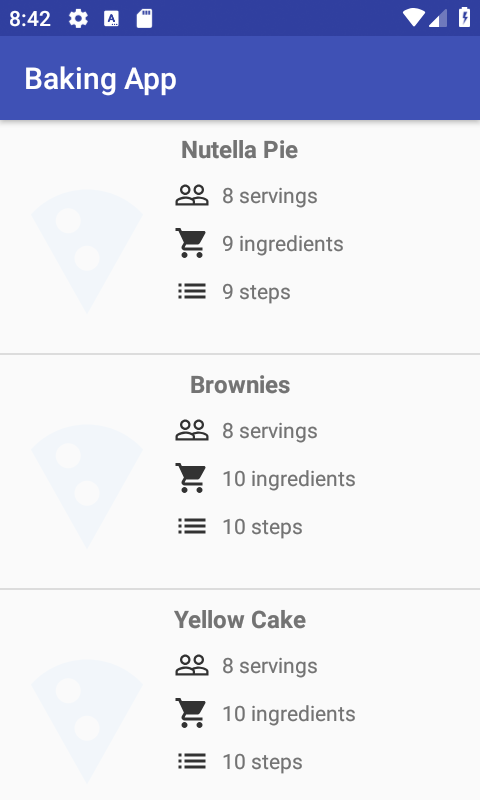
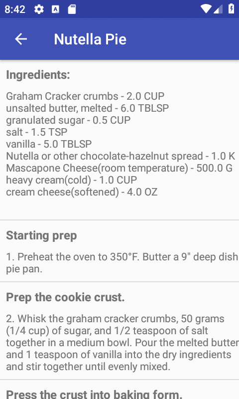
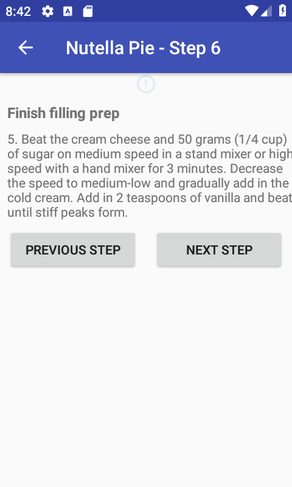
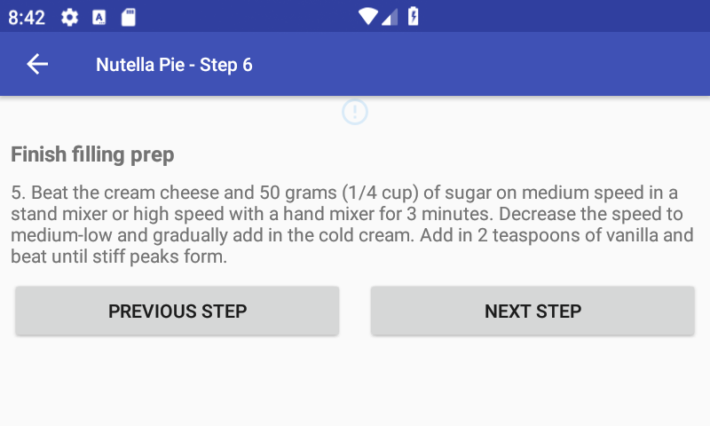
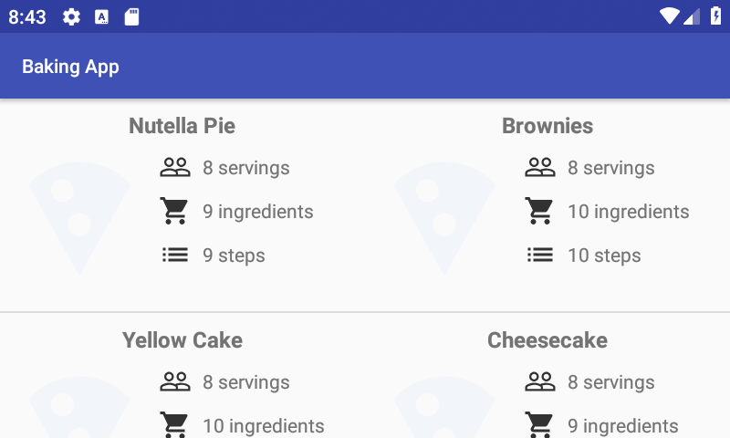

# BakingApp (Android App)
An app that loads different recipes from an API using Retrofit and shows them in a navigatable recycler view. Also, it takes benefit of different layout files to better use the space in the landscape views.

# Screenshots

  
  
  

  
  

